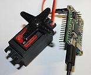

.. Copyright (C) Karanvir Dhillon, Kevin Cole, and Jeffrey Elkner. Permission
   is granted to copy, distribute and/or modify this document under the terms
   of the Creative Commons Attribution-ShareAlike 4.0 International Public
   License.

.. _getting_started:

Getting Started
===============

*How to use various electronic and electric parts with PyBoard - like DC and
stepper motors, I2C devices, relays and sensors*

So we continue our adventure with PyBoard and MicroPython. In this article I'll
show how to use various electronic and electric parts with PyBoard - like DC
and stepper motors, I2C devices, relays and sensors.

Code from this article is available at `this github repo
<https://github.com/riklaunim/python-electronics/tree/master/micropython>`__.

Continuous Servo
================

Most servos can only move within given bounds and you can set an angle with the
Servo class from pyb module. There are also continuous servos that don't have
such limitations. **speed** method may be used for them to set direction and
speed of the servo (from -100 to 100):

.. sourcecode:: python3

    import pyb
    servo = pyb.Servo(1)
    servo.speed(10)

